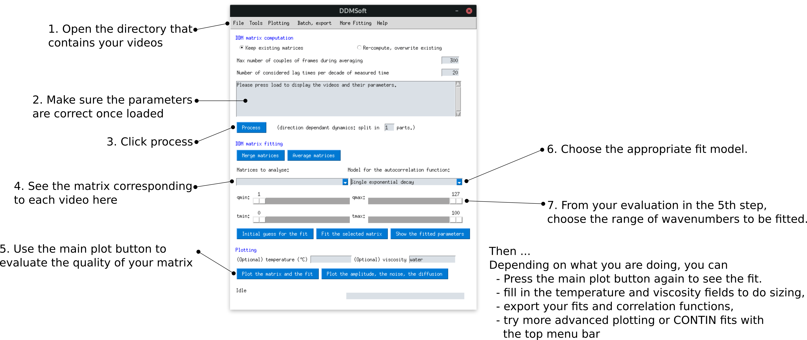

## Basic workflow with DDMSoft
We have used DDMSoft extensively in our differential dynamic microscopy routine, and we think that our workflow has become quite efficient. The main line are as follows:

1. Have DDMSoft installed on the same computer that captures the microscopy videos.
2. After recording some videos: in folder that contains the videos, create companion textfiles with 
 * The pixel size in meters 
 * The acquisition frame rate in frames per second
  It should look like this
  ```
  pixelsize: 1.1e-7 
  framerate: 913
  ```
You may then switch to DDMSoft and refer to the image below.



