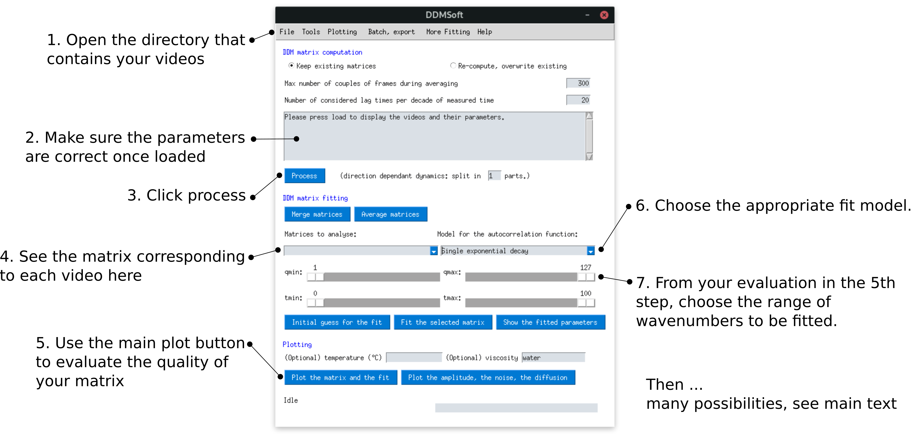

## Basic workflow with DDMSoft
We have used DDMSoft extensively in our differential dynamic microscopy routine, and we think that our workflow has become quite efficient. The main lines are as follows:

* Have DDMSoft installed on the same computer that captures the microscopy videos.
* After recording some videos: in folder that contains the videos, create companion textfiles with 
 * The pixel size in meters 
 * The acquisition frame rate in frames per second
  The content of the text file should look like this
  ```
  pixelsize: 1.1e-7 
  framerate: 913
  ```
  You can either create a single text file for all the videos (the same parameters will then apply to all of them), or create one textfile per video with the same name (but ending in .txt rather than e.g. .avi).

You may then switch to DDMSoft and refer to the image below.



The next steps depend on what you are doing. Here are some examples:
* If doing sizing, fill in the temperature and viscosity values, then press `Plot the amplitude,the noise, the diffusion` 
* If doing sizing again, try the CONTIN algorithm implemented in the `More Fitting` top menu.
* Export your correlation functions, matrix or fit parameters with the `Batch, export` top menu.
* Plot an overview of your matrix, fit and correlation functions with the `Plotting` top menu.


## Examples of DDM results obtained with DDMSoft

### Sizing of microgels at different temperatures
Using a temperature-controlled sample holder on the microscope, we replicated the DLS results of the temperature dependence of some of our microgels.


### Sizing using the structure appearing at high concentration
DDM yields not only a correlation function at each wavenumber, but also an amplitude. This amplitude can be used to extract the structure factor that appears at high concentrations.  We managed to recover the size of a microgel using this technique.

### Fitting concentrated samples 
DDM does not fear multiple scattering as much as DLS, thereby accurate correlation can be extracted off very concentrated samples. These can then be fitted with the appropriate models describing the different timescales of the diffusion.

### (More to come after the paper is published)
